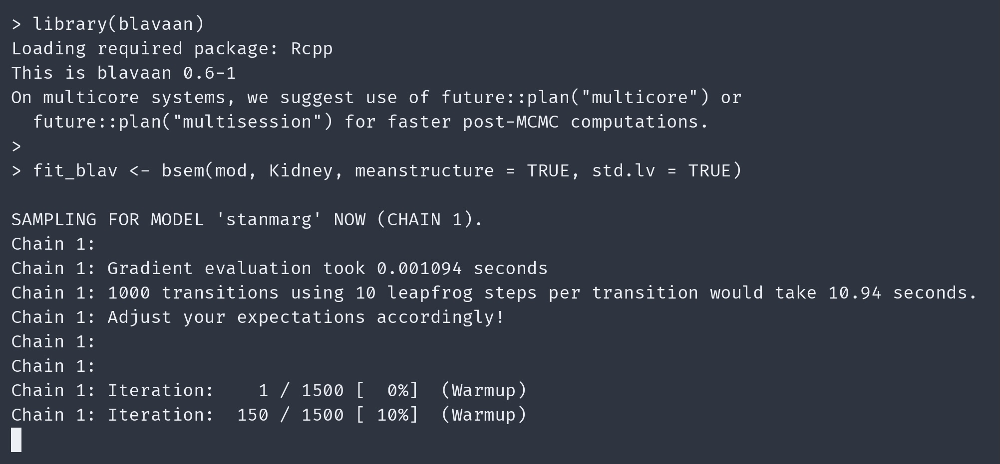

## The R/INLAvaan package

::: {.absolute top=-38 left=600}
{height=30px}
{height=30px}
:::

::: {.columns}

::: {.column width=48%}
::: {.nudge-down-xs}
```{r}
#| include: false
#| cache: false
options(width = 40)
```
```{r}
#| echo: true
#| message: false
# Check data set
glimpse(Kidney)
library(INLAvaan)
mod <- "
  # Measurement model
  GlyCon =~ y1 + y2 + y3
  KdnHlt =~ y4 + y5 + y6

  # Structural model
  KdnHlt ~ GlyCon
"
```
```{r}
#| include: false
#| cache: false
options(width = 80)
```
:::
:::

::: {.column width=52%}

<!-- Cast call: -->
<!-- agg --theme nord --font-family "Fira Code" --font-size 35 --cols 49 --rows 12 inlavaan-kidney.cast inlavaan.gif -->
::: {.content-visible unless-meta="nogif"}
::: {.nudge-up-small}
{width=100% fig-align='center'}
:::

::: {.nudge-up}
```{r, engine = "tikz", code = dag_tikz(5, psi_fixed = TRUE)}
#| eval: true
#| fig-align: center
#| out-width: 95%
```
:::

:::

::: {.content-hidden unless-meta="nogif"}
```{r}
#| label: inlavaan-demo
#| echo: false
#| message: true
#| eval: true
fit <- INLAvaan::asem(
  model = mod,
  data = Kidney,
  meanstructure = TRUE,
  std.lv = TRUE
)
timing(fit)
```

::: {.nudge-down-small}
```{r, engine = "tikz", code = dag_tikz(5, psi_fixed = TRUE)}
#| eval: true
#| fig-align: center
#| out-width: 95%
```
:::

:::

:::

:::

## (b)lavaan S4 methods

```{r}
#| include: false
options(width = 60)
fit <- INLAvaan::asem(
  model = mod,
  data = Kidney,
  meanstructure = TRUE,
  std.lv = TRUE
)
```

::: {.columns}

::: {.column width=65%}
```{r}
#| echo: true
print(fit)
```
:::

::: {.column width=25%}
Also available:

- `fitmeasures()`
- `fitted()`
- `predict()`
- `standardisedsolution()`
- `vcov()`
- `plot()`
:::
:::


```{r}
#| include: false
options(width = 80)
x <- capture.output(coef(fit))
x <- x[1:6]
x[length(x) - 1] <- sub("\\S+(\\s*)$", "\\1", x[length(x) - 1])
x[length(x)]     <- sub("\\S+(\\s*)$", "...\\1", x[length(x)])
coef_print <- x
```

::: {.nudge-down}
```r
coef(fit)
```
```{r}
cat(paste0(coef_print, collapse = "\n"))
```
:::

## Summary {.scrollable}

```r
summary(fit)
```

```{r}
#| label: demo-summary
summ <- capture.output(summary(fit))
summ <- c("<output truncated>", summ[-(1:12)])
cat(paste0(summ, collapse = "\n"))
```

## Comparison to MCMC

- Interchangeable commands (c.f. `bsem()`) with `blavaan` [@merkle2021efficient] which interfaces with `Stan` [@carpenter2017stan].

::: {.content-visible unless-meta="nogif"}
{fig-align="center" width="90%"}
:::

::: {.content-hidden unless-meta="nogif"}
{fig-align="center" width="90%"}
:::

## Comparison to MCMC *(cont.)*

::: {.nudge-up}
```{r}
#| label: comparison
#| out-width: 100%
#| fig-width: 8.5
#| fig-height: 4.9
#| cache: true
load("R/p_compare.RData")
p_compare
```
:::

::: aside
MCMC: 3 chains of 1,000 draws each, after 500 burn-in. % are 1 minus Jensen–Shannon divergences.
:::

## Parameter recovery from simulated data

```{r}
#| label: simulations
#| out-width: 100%
#| fig-width: 8
#| fig-height: 4.7
#| cache: true
load("R/p_simulations.RData") #
library(patchwork)
p1 + p2 + p3 + p4 + p5 + plot_layout(axes = "collect", nrow = 1)
```

## Effects of prior distributions

- Loadings: $\lambda \sim \operatorname{N}(0,10^2) \mapsto \lambda \sim \operatorname{N}(2,0.1^2)$

```{r}
#| label: priorlambda
#| out-width: 100%
#| fig-width: 8
#| fig-height: 1.6
load("R/p_priors.RData")
p1
```

- Residual variances: $\theta^{1/2} \sim \Gamma(1,0.5) \mapsto \theta \sim \Gamma(100,50)$

```{r}
#| label: priortheta
#| out-width: 100%
#| fig-width: 8
#| fig-height: 1.6
load("R/p_priors.RData")
p2
```

## Factor scores and latent regression

```{r}
#| include: false
load("R/p_latent.RData")
eta <- predict(fit, type = "lv")
x <- capture.output(print((eta), n = 5))
eta_print <- x[-(1:2)]
```

::: {.columns}

::: {.column width=50%}
```r
eta <- predict(fit, type = "lv")
print(eta)
```
```{r}
cat(paste0(eta_print, collapse = "\n"))
```

- Posterior of $\boldsymbol\eta_i$ for all $n=250$ patients.

::: {.fragment fragment-index=1}
- **Halo**: 95% posterior region (SD $\approx$ `r sprintf("%.2f", lv_stats$post_sd[1])` for $\eta_1$, `r sprintf("%.2f", lv_stats$post_sd[2])` for $\eta_2$).
:::

::: {.fragment fragment-index=2}
- [**Line**]{.text-mer}: SEM's $\beta =$ `r sprintf("%.2f", lv_stats$beta)` [`r sprintf("%.2f", lv_stats$beta_lo)`, `r sprintf("%.2f", lv_stats$beta_hi)`], estimated *jointly*.
:::
:::

::: {.column width=50%}
::: {.r-stack}

:::: {.fragment .fade-out fragment-index=1}
```{r}
#| fig-width: 5.6
#| fig-height: 5.8
#| fig-align: center
#| out-width: 88%
p_lv1 #
```
::::

:::: {.fragment .fade-in-then-out fragment-index=1}
```{r}
#| fig-width: 5.6
#| fig-height: 5.8
#| fig-align: center
#| out-width: 88%
p_lv2 #
```
::::

:::: {.fragment .fade-in fragment-index=2}
```{r}
#| fig-width: 5.6
#| fig-height: 5.8
#| fig-align: center
#| out-width: 88%
p_lv3 #
```
::::

:::
:::

:::

## Refit-free Leave-One-Out Cross-Validation

```{r}
#| echo: true
tictoc::tic()
loo(fit)
tictoc::toc()
```

