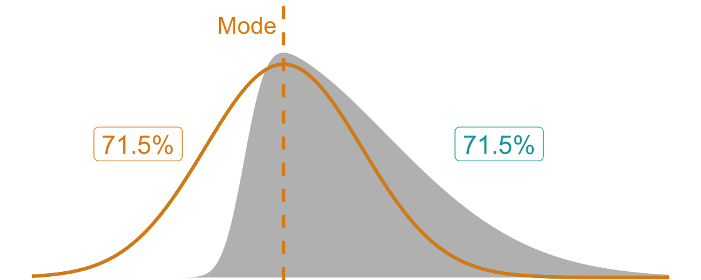
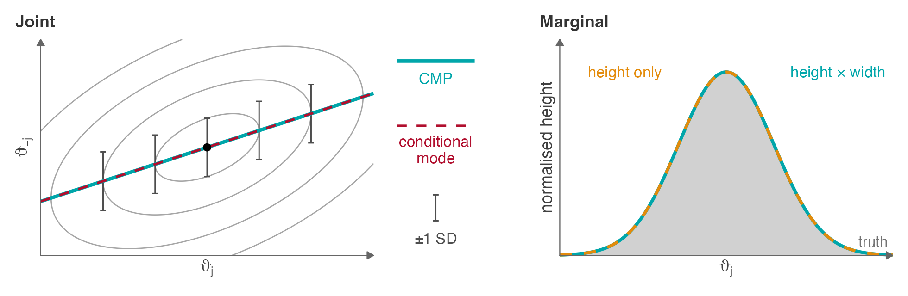
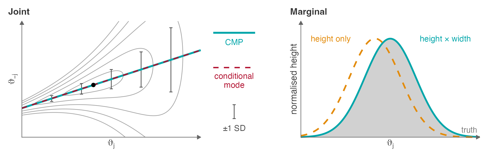

## Overview

```{r}
#| include: false
#| eval: true
# TikZ template for the step-by-step overview flowchart; \flowstep controls what is shown
flow_tmpl <- r"---(
\usetikzlibrary{arrows.meta,fit,calc}
\definecolor{kausttur}{RGB}{0, 166, 170}
\definecolor{kaustorg}{RGB}{241, 143, 0}
\definecolor{kaustgrn}{RGB}{173, 191, 4}
\definecolor{ink}{RGB}{39, 52, 59}
\newcommand{\vt}{\boldsymbol\vartheta}
\newcommand{\Om}{\boldsymbol\Omega}
\newcommand{\by}{\mathbf y}
\newcommand{\Nm}{\mathrm N_m}
\newcommand{\SN}{\mathrm{SN}}
% Step number in a box corner, enclosed by an inward quarter-circle arc (as in the paper)
\newcommand{\badgeNW}[3]{%
  \draw[draw=#2, line width=.8pt] ([xshift=5.6mm]#1.north west)
    arc[start angle=0, end angle=-90, radius=5.6mm];
  \node[font=\normalsize\sffamily\bfseries, text=#2, inner sep=0pt]
    at ([xshift=2.4mm,yshift=-2.3mm]#1.north west) {#3};}
\newcommand{\badgeSW}[3]{%
  \draw[draw=#2, line width=.8pt] ([xshift=5.6mm]#1.south west)
    arc[start angle=0, end angle=90, radius=5.6mm];
  \node[font=\normalsize\sffamily\bfseries, text=#2, inner sep=0pt]
    at ([xshift=2.4mm,yshift=2.3mm]#1.south west) {#3};}
\pgfdeclarelayer{canvas}
\pgfdeclarelayer{lanes}
\pgfsetlayers{canvas,lanes,main}
\begin{tikzpicture}[
  font=\normalsize, text=ink,
  % Slightly heavier text: outline each glyph with a thin stroke in its own colour
  every node/.append style={
    execute at begin node={\pdfliteral{q 2 Tr 0.18 w}},
    execute at end node={\pdfliteral{Q}}},
  box/.style={draw, line width=0.8pt, rounded corners=3pt, align=flush center,
    inner sep=2.5mm, fill=white},
  sub/.style={box, text width=#1, minimum height=1.5cm},
  lane/.style={inner sep=2.5mm, rounded corners=6pt, line width=0.6pt},
  head/.style={font=\large\sffamily\bfseries},
  flow/.style={-{Stealth[length=2.4mm]}, line width=1.1pt},
  reuse/.style={-{Stealth[length=2mm]}, densely dashed, line width=0.8pt, draw=ink!60},
  use/.style={box, draw=ink!30, fill=ink!4, text width=4cm},
  note/.style={font=\small\itshape, text=ink!80},
  % Everything is drawn at every step (so all images share one size);
  % elements belonging to a later step are made invisible.
  step/.code={\ifnum\flowstep<#1\relax\tikzset{opacity=0}\fi}
]

% Exact posterior
\node[box, draw=ink!60, fill=ink!4, text width=4.1cm] (post) at (0, 0)
  {{\sffamily\bfseries Exact posterior}\\[1mm]
   $\pi(\vt\mid\by)\propto\pi(\vt)\,\pi(\by\mid\vt)$};

% Step 1: Laplace's method on the joint
\begin{scope}[step=1]
  \node[sub=3.8cm, draw=kausttur, minimum height=1.2cm] (a1) at (6.9, 2.6)
    {\textbf{(a)} Mode \& curvature\\[1mm] $\Nm(\vt^*, \Om)$};
  \node[sub=3.8cm, draw=kausttur, minimum height=1.2cm] (b1) at (11.8, 2.6)
    {\textbf{(b)} VB mean correction\\[1mm] $\Nm(\tilde\vt, \Om)$};
  \draw[flow, kausttur] (a1) -- (b1);
  \node[head, text=kausttur, anchor=south] (l1) at ($(a1.north)!0.5!(b1.north) + (0, 1mm)$)
    {Joint Gaussian approximation};
  \begin{pgfonlayer}{lanes}
    \node[lane, fit={(a1)(b1)([yshift=-2mm]l1.north)}, fill=kausttur!8, draw=kausttur!50, step=1] (lane1) {};
  \end{pgfonlayer}
  \draw[flow, kausttur] (post.east) to[out=0, in=180]
    node[note, align=center, pos=0.5, above left] {Laplace's method} (lane1.west |- a1);
  \node[use] (u1) at (17.6, 2.6)
    {\textbf{Model comparison}\\[0.5mm] {\small log-evidence,\\ Bayes factors, LOO-CV}};
  \draw[flow, ink!60] (lane1.east |- b1) -- (u1);
  \badgeNW{lane1}{kausttur}{1}
\end{scope}

% Step 2: Laplace's method on the marginal integrals
\begin{scope}[step=2]
  \node[sub=2.3cm, draw=kaustorg] (a2) at (6.1, -2.6)
    {\textbf{(a)} Height\\[1mm] {\small CMP scan}};
  \node[sub=2.3cm, draw=kaustorg] (b2) at (9.35, -2.6)
    {\textbf{(b)} Volume\\[1mm] {\small correction}};
  \node[sub=2.3cm, draw=kaustorg] (c2) at (12.6, -2.6)
    {\textbf{(c)} SN fit\\[1mm] {\small $\SN(\hat\xi_j,\hat\omega_j,\hat\alpha_j)$}};
  \draw[flow, kaustorg] (a2) -- (b2);
  \draw[flow, kaustorg] (b2) -- (c2);
  \node[head, text=kaustorg, anchor=north] (l2) at ($(a2.south)!0.5!(c2.south) - (0, 1mm)$)
    {Skew-normal marginals};
  \begin{pgfonlayer}{lanes}
    \node[lane, fit=(a2)(c2)(l2.north)(l2.base), fill=kaustorg!8, draw=kaustorg!50, step=2] (lane2) {};
  \end{pgfonlayer}
  \draw[flow, kaustorg] (post.east) to[out=0, in=180]
    node[note, align=center, pos=0.5, below left] {Simplified Laplace\\profiling} (lane2.west |- a2);
  \draw[reuse] (lane1.south -| a1.south) to[bend right=20] node[note, left, align=center] {Shared\\$(\vt^*, \Om)$} ([xshift=9mm]lane2.north -| a2.north);
  \node[use] (u2) at (17.6, -2.6)
    {\textbf{Parameter inference}\\[0.5mm] {\small posterior means,\\ SDs, intervals}};
  \draw[flow, ink!60] (lane2.east |- c2) -- (u2);
  \badgeSW{lane2}{kaustorg}{2}
\end{scope}

% Step 3: Gaussian copula combines the two
\begin{scope}[step=3]
  \node[box, draw=kaustgrn!80!black, fill=kaustgrn!10, text width=3.7cm] (cop) at (11.7, 0)
    {{\sffamily\bfseries\color{kaustgrn!65!black} Gaussian copula}\\[1mm]
     draws $\vt^{(1)}, \dots, \vt^{(B)}$};
  \draw[flow, kausttur] (b1.south) -- node[note, right, pos=0.6] {$\mathbf R = \operatorname{cor}(\Om)$} (cop.north -| b1.south);
  \draw[flow, kaustorg] (c2.north) -- node[note, right, pos=0.55] {SN quantiles} (cop.south -| c2.north);
  \node[use] (u3) at (17.6, 0)
    {\textbf{Anything else}\\[0.5mm] {\small transformations,\\ factor scores, PPP, DIC}};
  \draw[flow, ink!60] (cop) -- (u3);
  \badgeNW{cop}{kaustgrn!65!black}{3}
\end{scope}

% Opaque white canvas (same size at every step, so the images stack exactly)
\begin{pgfonlayer}{canvas}
  \fill[white] ([shift={(-2mm,-2mm)}]current bounding box.south west)
    rectangle ([shift={(2mm,2mm)}]current bounding box.north east);
\end{pgfonlayer}
\end{tikzpicture}
)---"
flow_tikz <- function(step) paste0("\\def\\flowstep{", step, "}", flow_tmpl)
```

::: {.r-stack style="width: 1150px; margin: 0 auto;"}
```{r, engine = "tikz", code = flow_tikz(0)}
#| eval: true
```

::: {.fragment fragment-index=1}
```{r, engine = "tikz", code = flow_tikz(1)}
#| eval: true
```
:::

::: {.fragment fragment-index=2}
```{r, engine = "tikz", code = flow_tikz(2)}
#| eval: true
```
:::

::: {.fragment fragment-index=3}
```{r, engine = "tikz", code = flow_tikz(3)}
#| eval: true
```
:::
:::

::: {.fragment fragment-index=4}
- Not quite R-INLA: This is a "bespoke" INLA for SEM, keeping only the ideas that carry over (Laplace, skew-normal marginals, VB correction).

- Works because the exact posterior is cheap. For normal SEM, $\pi(\mathbf y \mid \boldsymbol\vartheta)$ is closed form, so $\pi(\boldsymbol\vartheta \mid \mathbf y)$ and its gradients are cheap to evaluate.
:::


## [Step 1a] Joint Gaussian approximation

::: {.callout-tip}
#### Laplace approximation [@tierney1989fully;@kass1995bayes]

Assume that $f(\boldsymbol\vartheta):=\log \left\{\pi(\mathbf y\mid \boldsymbol\vartheta) \, \pi(\boldsymbol\vartheta)\right\}$ is twice continuously differentiable with a unique interior maximiser $\boldsymbol\vartheta^*$, at which $\mathbf H=-\nabla^2 f(\boldsymbol\vartheta^*)$ is positive definite.
Consider the Taylor expansion of $f$ about $\boldsymbol\vartheta^*$,

$$
f(\boldsymbol\vartheta) \approx f(\boldsymbol\vartheta^*) 
% + \cancel{\nabla f(\boldsymbol\vartheta^*)^\top (\boldsymbol\vartheta - \boldsymbol\vartheta^*)} 
- \frac12 (\boldsymbol\vartheta - \boldsymbol\vartheta^*)^\top  \mathbf H (\boldsymbol\vartheta - \boldsymbol\vartheta^*).
$${#eq-laplace}

Therefore, $\pi(\boldsymbol\vartheta \mid \mathbf y) \approx \mathcal N_m(\boldsymbol\vartheta^*, \boldsymbol\Omega)$, where $\boldsymbol\Omega = \mathbf H^{-1}$
:::

. . .

- Work on an unconstrained scale (log variances, Fisher-$z$ correlations). Make the log-posterior closer to quadratic, so Laplace is more accurate.

. . .

- Under standard regularity conditions, the approximation achieves a *relative* error of $\mathcal{O}(n^{-1})$ for the posterior density and marginal likelihood [@rue2017bayesian]---c.f. additive $\mathcal{O}(n^{-1/2})$ error typical of simulation-based methods.

- By the Bernstein-von Mises theorem, the posterior concentrates at a rate of $n^{-1/2}$ and converges to a Gaussian in total variation [@vandervaart1998asymptotic].

## [Step 1a] Joint Gaussian approximation *(cont.)*

```{r}
#| include: false
#| eval: true
library(patchwork)
load("R/p_laplace_logscale.RData") #
```

::: {.nudge-down-medium}
::::: {.r-stack}

:::: {.fragment .fade-out fragment-index=1}
```{r}
#| eval: true
#| fig-height: 3.5
#| fig-width: 8
#| fig-align: center
#| out-width: 100%
p0
```
::::

:::: {.fragment .fade-in-then-out fragment-index=1}
```{r}
#| eval: true
#| fig-height: 3.5
#| fig-width: 8
#| fig-align: center
#| out-width: 100%
p1
```
::::

:::: {.fragment .fade-in-then-out fragment-index=2}
```{r}
#| eval: true
#| fig-height: 3.5
#| fig-width: 8
#| fig-align: center
#| out-width: 100%
p2
```
::::

:::: {.fragment .fade-in fragment-index=3}
```{r}
#| eval: true
#| fig-height: 3.5
#| fig-width: 8
#| fig-align: center
#| out-width: 100%
p3 
```
::::

:::::
:::

## [Step 1b] Variational mean correction

::: {.columns}

::: {.column width="50%"}
- Posterior mode is often far away from the "typical set", especially for skewed distributions.

- Laplace may misrepresent the bulk of the distribution---correction needed!
:::

::: {.column width="50%"}
<!-- Animated version of R/variational.R; regenerate with R/variational_anim.R -->
{width=100% fig-align="center"}
:::

:::

. . .

::: {.nudge-up-small}
- @vanniekerk2024lowrank propose a Variational Bayes (VB) correction to the mean of global Laplace:
$$
{\hat{\boldsymbol\delta}} = \operatorname{argmin}_{\boldsymbol\delta} \operatorname{D}_{\text{KL}}\big( \mathcal N_m( \boldsymbol\vartheta^* + {\boldsymbol\delta}, \mathbf H^{-1}) \;\big\Vert\; \pi(\cdot \mid \mathbf y) \big).
$$
   - Distribution that minimises *information loss* [@zellner1988optimal].
   - Reuse the Laplace curvature (good locally) and correct only the centre: an $m$-dimensional optimisation instead of re-estimating an $m \times m$ covariance.
   - Shift the whole Gaussian towards the posterior mean.
:::


<!-- ::: aside -->
<!-- Let $\vartheta \sim \SN(\xi, \omega, \alpha)$. Then $f_{SN}(\vartheta) =$ -->
<!-- ::: -->

::: aside
Overlap (area shared by the two densities): $\int \min\{p(\vartheta), q(\vartheta)\} \, d\vartheta = 1 - \frac12 \int |p(\vartheta) - q(\vartheta)| \, d\vartheta$.
:::

## [Step 2] Posterior marginals

- Use **Laplace's method** (-@eq-laplace), this time to approximate an integral:

::: {style="font-size: 90%;"}
$$
\pi(\vartheta_j \mid \mathbf y) = \int_{\mathbb R^{m-1}} e^{\log \pi(\vartheta_j, \boldsymbol\vartheta_{-j} \mid \mathbf y)} \, d \boldsymbol\vartheta_{-j}
\approx (2\pi)^{\frac{m-1}{2}} \times 
\overbrace{\pi\big(\vartheta_j, \boldsymbol\vartheta_{-j}^*(\vartheta_j) \mid \mathbf y\big)}^{\text{height}} \times 
\overbrace{\left| \mathbf H_{-j}(\vartheta_j) \right|^{-1/2 }}^{\text{(cond.) width}} 
$$
:::

::: {.fragment fragment-index=1}
- <u>Geometric intuition</u>: the marginal at each $\vartheta_j$ is the volume of the posterior's slice there, roughly the slice's *peak height* times its *width*.
:::
 
::: {.columns}

::: {.column width="46%"}
::: {.fragment fragment-index=2}
- This is [**expensive**]{.text-mer} to compute, as for every $\vartheta_j$ evaluation, need

  1. An optimisation of $\boldsymbol\vartheta_{-j}\in\mathbb R^{m-1}$ at this location; and
  2. The (log) determinant of the Hessian there.

- Next slides: two important results.
:::
:::

::: {.column width="54%"}
::: {.fragment fragment-index=1}
```{r}
#| label: slices
#| file: "R/slices.R"
#| fig-height: 4.5
#| fig-width: 8.2
#| fig-align: center
#| out-width: 100%
```
:::
:::

:::

## [Step 2a] Posterior marginals---the "height"


::: {.callout-note icon=false}
#### Lemma 1 (Conditional Mean Path) [= No need for reoptimisation]{.text-org}

Let $\small \boldsymbol\vartheta\sim\operatorname{N}_m(\boldsymbol\vartheta^*,\boldsymbol\Omega)$ with $\small\boldsymbol\Omega \succ \mathbf 0$. 
Then the marginal density of the $\small j$th component, $\small j=1,\dots,m$, is proportional to the joint density evaluated along its CMP:
$$
\small
\pi(\vartheta_j=x)
\propto
\pi\big(\vartheta_j=x, \, \boldsymbol\vartheta_{-j} = \operatorname{E}[ \boldsymbol\vartheta_{-j} \mid \vartheta_j=x] \big).
$$
:::

<!-- Figure first (R/cmp_paths.R); one click swaps it for the bullets -->
::: {.nudge-up-small}
:::: {.r-stack}
::: {.fragment .fade-out fragment-index=1}
{fig-align='center' width=1300px}
:::

::: {.fragment .fade-in fragment-index=1 style="width: 100%;"}
::: {.nudge-up}
- Operationally,
   i. Lay out a grid $\mathcal G_j=\big\{\boldsymbol\vartheta^* + t\,\mathbf v_j \;\big|\;t\in[-4,4]\big\}$, $\mathbf v_j = \Omega_{jj}^{1/2} \, \boldsymbol\Omega_{\cdot j}$.
   ii. Evaluate joint posterior $\pi(\boldsymbol\vartheta \mid \mathbf y)$ at each grid point.

- Scanning along the CMP is cheap; no re-optimisation needed.

- For Gaussian posteriors, this is **exact**; otherwise it provides a first-order approximation to a potentially curved ridge. 
:::
:::
::::
:::

## [Step 2b] Posterior marginals---the "width"

::: {.callout-note icon=false}
#### Lemma 2 (Efficient volume correction) [= No need to factor dense Hessian]{.text-org}

For the $\small j$th component along the CMP, $\small-\frac12 \log | \mathbf H_{-j}(t) | \approx \text{const.} + t\gamma_j'$. 
Then
$$
\small
\gamma_j' = 
-\frac{1}{2} \sum_{k=1}^m \frac{d}{dt} \left[ \mathbf{L}_{\cdot k}^{\top}\,\frac{d}{d\mathbf{L}_{\cdot k}}\mathbf{g} \right]_{t=0} 
+ \frac{1}{2}\, \frac{d}{dt} \left[ \mathbf{v}_j^{\top}\,\frac{d}{d\mathbf{v}_j}\mathbf{g} \right]_{t=0},
$$
where $\small\mathbf{g}(\boldsymbol\vartheta) = -\nabla \log \pi(\boldsymbol\vartheta \mid \mathbf{y})$, and $\small\mathbf H(\boldsymbol\vartheta^*)^{-1}=\mathbf L\mathbf L^\top$.
:::

<!-- Figure first (R/cmp_paths.R); one click swaps it for the bullets -->
::: {.nudge-up-large}
:::: {.r-stack}
::: {.fragment .fade-out fragment-index=1}
{width=1200px}
:::

::: {.fragment .fade-in fragment-index=1 style="width: 100%;"}
::: {.nudge-up-small}
- For non-symmetric densities, the conditional spread ("width") changes along the scan line. This change can be computed entirely via directional derivatives.

- Forward difference cost is only $m+2$ gradient evaluations for each $j$. Note: Baseline is unity in whitened coordinates.
  i. [`outer` $\small\nabla^3$] Shift to $\boldsymbol\vartheta^+$ along CMP, evaluate gradient.
  ii. [`inner` $\small\nabla^2$] Perturb along $\mathbf{L}_{\cdot k}$ and the scan direction $\mathbf{v}_j$, evaluating gradients. 
:::
:::
::::
:::

## [Step 2c] Posterior marginals---SN curve fit

::: {.nudge-down-small}
::: {.columns}
::: {.column width=55%}
- Consider the paired points $\{\vartheta_j(t_k), h_{kj}\}_{k=1}^K$, where
  - $t_k\in[-4,4]$ are standardised grid points,
  - $\vartheta_j(t_k) = \boldsymbol\vartheta^* + t_k  \mathbf v_j$ from the CMP, and
  - $h_{kj} := h_j(t_k) = \log \pi(\vartheta_j(t_k) \mid y ) + t \gamma_j'$ are unnormalised ordinates.

::: {.fragment fragment-index=2}
- Fit a skew normal pdf to these points via weighted least squares. A convenient default is $w_{kj} \propto \exp(h_{kj})$, for $j=1,\dots m$.

- Map back from $t$ to $\vartheta_j$ scale via the affine $\vartheta_j = \vartheta_j^* + t\sqrt{\Omega_{jj}}$.

:::
:::

::: {.column width=45%}
::: {.fragment fragment-index=2}
```{r}
#| label: skewnormfit
#| message: false
#| file: "R/skewnorm.R"
#| fig-height: 5.1
#| fig-width: 4.8
#| fig-align: center
#| out-width: 100%
```
:::
:::
:::

::: {.fragment fragment-index=2}
::: {.nudge-up-large}
$$(\hat\xi_j,\hat\omega_j,\hat\alpha_j,\hat c_j)
=
\operatorname{argmin}_{\xi,\omega,\alpha,c} \,
\sum_{k=1}^K
w_{kj}\big[
h_{kj}-\big\{\log f_{\mathrm{SN}}(\vartheta_j(t_k);\xi,\omega,\alpha)+c\big\}
\big]^2$$
:::
:::
:::

## [Step 3] Gaussian copula sampling

$$
\underbrace{\mathbf z \sim N(\mathbf 0, \mathbf R)}_{\text{Gaussian correlation}} \xrightarrow{\quad \Phi(\cdot) \quad} \underbrace{\mathbf u}_{\ \text{Uniform} \ } \xrightarrow{\quad F_{\text{SN}}^{-1}(\cdot) \quad} \underbrace{\boldsymbol\vartheta}_{\text{SN Marginals}}
$$

- Reconstruct joint posterior samples $\{\boldsymbol\vartheta^{(1)},\dots,\boldsymbol\vartheta^{(B)}\}$ using a Copula [@nelsen2006introduction], preserving Gaussian correlations:
$$
\mathbf R = \mathbf D^{-1/2} \boldsymbol \Omega \mathbf D^{-1/2}, \qquad \mathbf D = \operatorname{diag}(\boldsymbol\Omega).
$$


- This also allows us to derive approximate posteriors for
  i. Parameter transformations, e.g. standardised solutions, non-linear transforms, etc.
  ii. Posterior Predictive P-value (PPP), e.g. $\#\{ T(\mathbf S_{\text{obs}}, \boldsymbol\Sigma(\boldsymbol\vartheta)) >  T(\mathbf S_{\text{rep}}, \boldsymbol\Sigma(\boldsymbol\vartheta)) \}$.
  iii. Factor scores, $\boldsymbol\eta \mid \{\mathcal Y, \boldsymbol\vartheta\} \sim \operatorname{N}_q(\mathbf m(\boldsymbol\vartheta), \mathbf V(\boldsymbol\vartheta))$.
  iv. Prediction and imputation.
