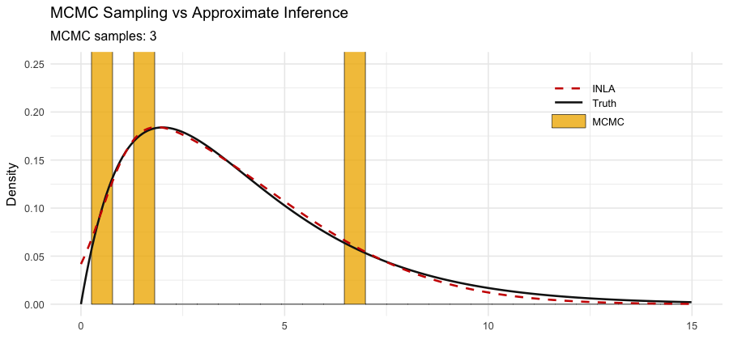
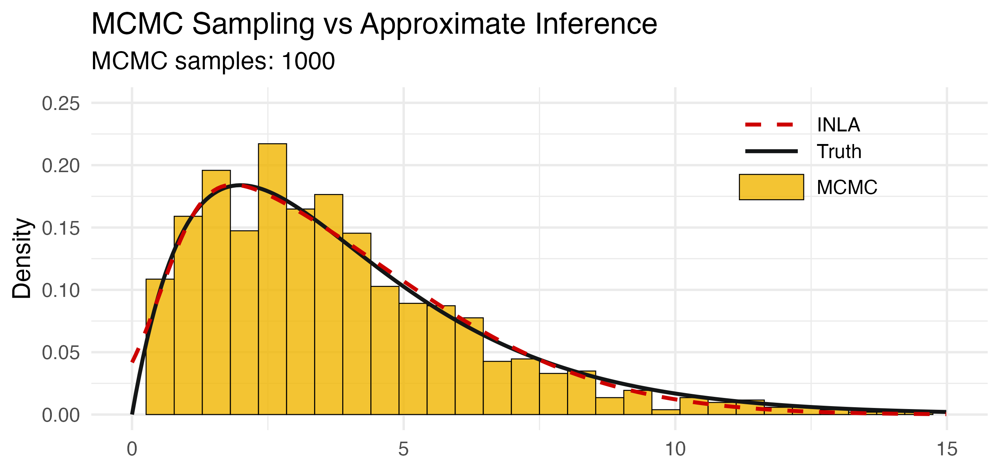

## Running example

### Glycemic control and kidney health

> Does poorer glycemic control lead to greater severity of kidney disease?

::: {.columns}

::: {.column width=48%}
Observe $p=6$ variables for each patient:

```{r}
#| html-table-processing: none
library(gt)

vars <- c(
  '<span class="math inline" style="color:#5284C4">\\\\(y_1\\\\)</span>',
  '<span class="math inline" style="color:#5284C4">\\\\(y_2\\\\)</span>',
  '<span class="math inline" style="color:#5284C4">\\\\(y_3\\\\)</span>',
  '<span class="math inline" style="color:#b10f2e">\\\\(y_4\\\\)</span>',
  '<span class="math inline" style="color:#b10f2e">\\\\(y_5\\\\)</span>',
  '<span class="math inline" style="color:#b10f2e">\\\\(y_6\\\\)</span>'
)

tbl <- data.frame(
  Variable = vars,
  Indicator = c("HbA1c", "FPG", "Insulin", "PCr", "ACR", "BUN"),
  Description = c(
    "3-month avg. blood glucose",
    "Fasting plasma glucose",
    "Fasting insulin level",
    "Plasma creatinine",
    "Albumin–creatinine ratio",
    "Blood urea nitrogen"
  ),
  Unit = c("%", "mmol/L", "µU/mL", "µmol/L", "mg/g", "mmol/L"),
  stringsAsFactors = FALSE
)

tbl |>
  gt() |>
  # tab_header(title = md("**Observed Variables**")) |>
  cols_label(
    Variable   = "",
    Indicator  = "Indicator",
    Description = "Description",
    Unit       = "Unit"
  ) |>
  fmt_markdown(columns = "Variable") |>
  tab_options(
    table.font.size = px(25),
    table.width = pct(100)
  ) |>  
  tab_style(
    style = cell_text(weight = "bold"),
    locations = cells_column_labels()
  ) |>
  opt_table_font(font = list(google_font("Raleway"), default_fonts()))
```

:::

::: {.column width=2%}
:::

::: {.column width=50%}
::: {.fragment}
::: {.nudge-down}
"*piecemeal*" thinking leads to
$$
\small
\begin{align*}
\textcolor{kaustmer}{y_{4}} &= \beta_0^{(4)} + \beta_1^{(4)} \textcolor{kaustblu}{y_{1}} + \beta_2^{(4)} \textcolor{kaustblu}{y_{2}} + \beta_3^{(4)} \textcolor{kaustblu}{y_{3}} + \epsilon^{(4)} \\
\textcolor{kaustmer}{y_{5}} &= \beta_0^{(5)} + \beta_1^{(5)} \textcolor{kaustblu}{y_{1}} + \beta_2^{(5)} \textcolor{kaustblu}{y_{2}} + \beta_3^{(5)} \textcolor{kaustblu}{y_{3}} + \epsilon^{(5)} \\
\textcolor{kaustmer}{y_{6}} &= \beta_0^{(6)} + \beta_1^{(6)} \textcolor{kaustblu}{y_{1}} + \beta_2^{(6)} \textcolor{kaustblu}{y_{2}} + \beta_3^{(6)} \textcolor{kaustblu}{y_{3}} + \epsilon^{(6)} \\
\end{align*}
$$

- Does not give a clear and direct answer.

- Moreover, variables are assumed to be measured without error.

:::
:::
:::

:::


::: aside
Example adapted from @song2012basic.
:::

## Covariance-based approach

::: {.columns}

::: {.column width=45%}
::: {.nudge-up-small}
Sample correlation matrix looks like this^[Simulated data from a two-factor SEM ($n=250$).]:

::: {.nudge-up-small}
```{r}
#| fig-align: center
#| out-width: 100%
#| fig-height: 4.5
#| fig-width: 4.5
z <- cor(Kidney)
colnames(z) <- rownames(z) <- c("y[1]","y[2]","y[3]","y[4]","y[5]","y[6]")

library(ggcorrplot)
ggcorrplot(
  z[, 6:1],
  lab = TRUE, lab_col = "black", lab_size = 4,
  colors = c("#00A6AA", "white", "#F18F00"),
  type = "full",    
  show.diag = TRUE
) +
  scale_x_discrete(position = "top", labels = scales::label_parse()) +
  scale_y_discrete(labels = scales::label_parse()) +
  theme(
    axis.text.x = element_text(angle = 0, hjust = 0.5),
    axis.ticks = element_blank(),
    legend.position = "none"
  )
```
:::
:::
:::

::: {.column width=55%}
::: {.nudge-down-small}
- The data suggests clustering of variables
   - [$y_1$,$y_2$,$y_3$]{.text-blu} measure *glycemic control* ([$\texttt{GlyCon}$]{.text-blu})
   - [$y_4$,$y_5$,$y_6$]{.text-mer} measure *kidney health* ([$\texttt{KdnHlt}$]{.text-mer})

<!-- - There is an element of dimension-reduction; much needed for analysing (correlated) multivariate data. -->

::: {.fragment}
- Easier to hypothesize relationships, e.g.
  $$
  {\color{kaustmer}\texttt{KdnHlt}} = \alpha + \beta \,  {\color{kaustblu}\texttt{GlyCon}} + \texttt{error}
  $$

- But these are <u>unobserved</u>---we only see their *footprint* on the correlation structure:
  - Items in a cluster share a latent cause, and 
  - Cross-cluster correlation flows through $\beta$.
:::

::: {.fragment}
::: {.nudge-up-xs}
- SEM models the **covariance structure**
$$
\boldsymbol\Sigma = \boldsymbol\Sigma(\boldsymbol\vartheta),
$$
where $\boldsymbol\vartheta$ are model parameters.
:::
:::

:::
:::

:::

## Directed acyclic graph (DAG)

```{r}
#| include: false
#| eval: true
# TikZ template for the step-by-step DAG slide; \dagstep controls what is shown
dag_tmpl <- r"---(
\usetikzlibrary{backgrounds,shapes.geometric,calc}
\definecolor{kaustorg}{RGB}{241, 143, 0}
\definecolor{kausttur}{RGB}{0, 166, 170}
\definecolor{kaustgrn}{RGB}{173, 191, 4}
\definecolor{kaustpur}{RGB}{156, 111, 174}
% Latent-variance labels: free parameters by default, or fixed to 1 (std.lv = TRUE)
% when \dagpsifixed is defined (see dag_tikz(..., psi_fixed = TRUE))
\ifdefined\dagpsifixed
  \newcommand{\psiA}{$\psi_{11} = 1$}\newcommand{\psiB}{$\psi_{22} = 1$}
\else
  \newcommand{\psiA}{$\psi_{11}$}\newcommand{\psiB}{$\psi_{22}$}
\fi
\begin{tikzpicture}[%
  >=stealth,
  line width=0.6pt,
  % Slightly heavier text: outline each glyph with a thin stroke in its own colour
  every node/.style={font=\large,
    execute at begin node={\pdfliteral{q 2 Tr 0.18 w}},
    execute at end node={\pdfliteral{Q}}},
  show background rectangle,
  background rectangle/.style={fill=white},
  latent/.style={circle, draw, minimum size=17mm, inner sep=0mm, font=\large\ttfamily},
  obs/.style={rectangle, draw, minimum height=8mm, minimum width=17mm, inner sep=1mm,
    font=\normalsize\ttfamily},
  intercept/.style={regular polygon, regular polygon sides=3, draw, inner sep=0pt,
    minimum size=8mm, font=\small},
  % Everything is drawn at every step (so all images share one size);
  % elements belonging to a later step are made invisible.
  step/.code={\ifnum\dagstep<#1\relax\tikzset{opacity=0}\fi}
]

% Variables
\node[latent] (eta1) at (-2.1, -2.6) {GlyCon};
\node[latent] (eta2) at ( 5.0, -2.6) {KdnHlt};
\foreach \i/\x/\lab in {1/-4.2/HbA1c, 2/-2.1/FPG, 3/0/Insulin,
                        4/2.9/PCr, 5/5.0/ACR, 6/7.1/BUN}
  \node[obs] (y\i) at (\x, 0) {\lab};
\foreach \i in {1,2,3} \draw[->] (eta1) -- (y\i);
\foreach \i in {4,5,6} \draw[->] (eta2) -- (y\i);

% Step 1: loadings
\begin{scope}[step=1]
  \path (eta1) -- node[pos=0.55, right] {\color{kaustpur}$\lambda_{11}$} (y1);
  \path (eta1) -- node[pos=0.5, right] {\color{kaustpur}$\lambda_{21}$} (y2);
  \path (eta1) -- node[pos=0.55, right] {\color{kaustpur}$\lambda_{31}$} (y3);
  \path (eta2) -- node[pos=0.55, right] {\color{kaustpur}$\lambda_{42}$} (y4);
  \path (eta2) -- node[pos=0.5, right] {\color{kaustpur}$\lambda_{52}$} (y5);
  \path (eta2) -- node[pos=0.55, right] {\color{kaustpur}$\lambda_{62}$} (y6);
\end{scope}

% Step 2: observed intercepts
\begin{scope}[step=2, black!55]
  \foreach \i in {1,...,6} {
    \node[intercept, black!55] (t\i) at ($(y\i.north) + (-0.4, 1.3)$) {$1$};
    \draw[->] (t\i) -- node[left] {$\nu_{\i}$} (t\i |- y\i.north);
  }
\end{scope}

% Step 3: residual variances (loop on top of each item)
\begin{scope}[step=3]
  \foreach \i in {1,...,6}
    \draw[<->, kaustorg] ([xshift=0.5mm]y\i.north) to[out=90, in=90, looseness=2.2]
      node[above] {$\theta_{\i\i}$} ([xshift=6.5mm]y\i.north);
\end{scope}

% Step 4: latent regression
\draw[->, kaustgrn, step=4] (eta1) -- node[midway, above] {$\beta$} (eta2);

% Step 5: latent variances
\begin{scope}[step=5, kausttur]
  \draw[<->] (eta1) to[out=200, in=240, looseness=4] node[below left] {\psiA} (eta1);
  \draw[<->] (eta2) to[out=-60, in=-20, looseness=4] node[below right] {\psiB} (eta2);
\end{scope}
\end{tikzpicture}
)---"
dag_tikz <- function(step, psi_fixed = FALSE) {
  paste0("\\def\\dagstep{", step, "}", if (psi_fixed) "\\def\\dagpsifixed{1}", dag_tmpl)
}
```

::: {.r-stack style="width: 980px; margin: 0 auto;"}
```{r, engine = "tikz", code = dag_tikz(0)}
#| eval: true
```

::: {.fragment fragment-index=1}
```{r, engine = "tikz", code = dag_tikz(1)}
#| eval: true
```
:::

::: {.fragment fragment-index=2}
```{r, engine = "tikz", code = dag_tikz(2)}
#| eval: true
```
:::

::: {.fragment fragment-index=3}
```{r, engine = "tikz", code = dag_tikz(3)}
#| eval: true
```
:::

::: {.fragment fragment-index=4}
```{r, engine = "tikz", code = dag_tikz(4)}
#| eval: true
```
:::

::: {.fragment fragment-index=5}
```{r, engine = "tikz", code = dag_tikz(5)}
#| eval: true
```
:::
:::

::: {.nudge-up}
::: {.fragment fragment-index=1}
- **Measurement model:** loadings $\color{kaustpur}\lambda$, intercepts $\color{Gray}\nu$, residual (co)variances $\color{kaustorg}\theta$.
:::
::: {.fragment fragment-index=4}
- **Structural model:** regression coefficients $\color{kaustgrn}\beta$, latent (co)variances $\color{kausttur}\psi$.
:::
::: {.fragment fragment-index=6}
- Collect free parameters in $\boldsymbol\vartheta \in\mathbb R^m$, where $m < p(p+1)/2 + p$.
:::
:::

## SEM equations

::: {.columns}

::: {.column width=48%}
::: {style="font-size: 90%;"}
$$
\small
\begin{gathered}
\begin{pmatrix}
y_1 \\
y_2 \\
y_3 \\
y_4 \\
y_5 \\
y_6
\end{pmatrix}
= 
\begin{pmatrix}
\nu_1 \\
\nu_2 \\
\nu_3 \\
\nu_4 \\
\nu_5 \\
\nu_6
\end{pmatrix}
+
\begin{pmatrix}
\textcolor{kaustpur}{\lambda_{11}} & 0 \\
\textcolor{kaustpur}{\lambda_{21}} & 0 \\
\textcolor{kaustpur}{\lambda_{31}} & 0 \\
0 & \textcolor{kaustpur}{\lambda_{42}} \\
0 & \textcolor{kaustpur}{\lambda_{52}} \\
0 & \textcolor{kaustpur}{\lambda_{62}} \\
\end{pmatrix}
\begin{pmatrix}
\eta_1 \\
\eta_2
\end{pmatrix}
+ 
{\color{Gray}
\begin{pmatrix}
\epsilon_1 \\
\epsilon_2 \\
\epsilon_3 \\
\epsilon_4 \\
\epsilon_5 \\
\epsilon_6
\end{pmatrix}} \\[1.1em]
\begin{pmatrix}
\eta_1 \\
\eta_2
\end{pmatrix}
=
\begin{pmatrix}
\alpha_1 \\
\alpha_2
\end{pmatrix}
+
\begin{pmatrix}
0 & 0 \\
{\color{kaustgrn}\beta} & 0 \\
\end{pmatrix}
\begin{pmatrix}
\eta_1 \\
\eta_2
\end{pmatrix}
+
{\color{Gray}
\begin{pmatrix}
\zeta_1 \\
\zeta_2
\end{pmatrix}}
\end{gathered}
$$
:::

::: {.fragment}

::: {.nudge-up-small}
Or, more compactly as

::: {.nudge-up-small}
$$
\begin{gathered}
\mathbf y = \boldsymbol\nu + {\color{kaustpur}\boldsymbol\Lambda} \boldsymbol\eta + {\color{Gray}\boldsymbol\epsilon} \\
\boldsymbol\eta = \boldsymbol\alpha + {\color{kaustgrn}\mathbf B} \boldsymbol\eta + {\color{Gray}\boldsymbol\zeta}
\end{gathered}
$$

with assumptions ${\color{Gray}\boldsymbol\epsilon}\sim\operatorname{N}_p(\mathbf 0, {\color{kaustorg}\boldsymbol\Theta})$, ${\color{Gray}\boldsymbol\zeta}\sim\operatorname{N}_q(\mathbf 0, {\color{kausttur}\boldsymbol\Psi})$, and $\operatorname{Cov}({\color{Gray}\boldsymbol\epsilon}, {\color{Gray}\boldsymbol\zeta})=\mathbf 0$.

:::
:::

:::
:::

::: {.column width=52%}
```{r, engine = "tikz"}
#| fig-align: center
#| out-width: 80%
\definecolor{kaustorg}{RGB}{241, 143, 0}
\definecolor{kausttur}{RGB}{0, 166, 170}
\definecolor{kaustmer}{RGB}{177, 15, 46}
\definecolor{kaustgrn}{RGB}{173, 191, 4}
\definecolor{kaustblu}{RGB}{82, 132, 196}
\definecolor{kaustpur}{RGB}{156, 111, 174}
\begin{tikzpicture}[%
  scale=0.88,
  >=stealth,
  auto,
  node distance=1.6cm,
  every node/.style={font=\small},
  latent/.style={font=\normalsize,circle, draw, minimum size=9mm, inner sep=0mm},
  obs/.style={font=\normalsize,rectangle, draw, minimum size=6mm, inner sep=0mm},
  error/.style={font=\normalsize,circle, draw=gray, text=gray, minimum size=5mm, inner sep=0mm}
]

% --------------------------------------------------------
% 1) LATENT VARIABLES
% --------------------------------------------------------
\node[latent] (eta1) at (-1.5, -2) {$\eta_{1}$};
\node[latent] (eta2) at ( 3.1, -2) {$\eta_{2}$};

% Disturbance terms at 225 and -45 degrees from each latent variable
\node[error] (z1) at ([shift={(200:1.2)}]eta1) {$\zeta_{1}$};
\node[error] (z2) at ([shift={(-20:1.2)}]eta2) {$\zeta_{2}$};
\draw[->, gray] (z1) -- (eta1);
\draw[->, gray] (z2) -- (eta2);

% --------------------------------------------------------
% 2) OBSERVED VARIABLES + ERROR TERMS
%    Place y1..y3 (for eta1) on the left, y4..y6 (for eta2) on the right.
% --------------------------------------------------------
\node[obs] (y1) at (-2.8, 0) {$y_{1}$};
\node[obs] (y2) at (-1.5, 0) {$y_{2}$};
\node[obs] (y3) at ( -0.2, 0) {$y_{3}$};

\node[obs] (y4) at ( 1.8, 0) {$y_{4}$};
\node[obs] (y5) at ( 3.1, 0) {$y_{5}$};
\node[obs] (y6) at ( 4.4, 0) {$y_{6}$};

% Error terms above each observed variable
\node[error] (e1) at (-2.8, 1) {$\epsilon_{1}$};
\node[error] (e2) at (-1.5, 1) {$\epsilon_{2}$};
\node[error] (e3) at ( -0.2, 1) {$\epsilon_{3}$};
\node[error] (e4) at ( 1.8, 1) {$\epsilon_{4}$};
\node[error] (e5) at ( 3.1, 1) {$\epsilon_{5}$};
\node[error] (e6) at ( 4.4, 1) {$\epsilon_{6}$};

% --------------------------------------------------------
% 3) PATHS FROM ERROR TERMS TO OBSERVED VARIABLES
% --------------------------------------------------------
\draw[->, gray] (e1) -- (y1);
\draw[->, gray] (e2) -- (y2);
\draw[->, gray] (e3) -- (y3);
\draw[->, gray] (e4) -- (y4);
\draw[->, gray] (e5) -- (y5);
\draw[->, gray] (e6) -- (y6);

% --------------------------------------------------------
% 4) FACTOR LOADINGS
%    \eta_{i1} -> y1, y2, y3
%    \eta_{i2} -> y4, y5, y6
% --------------------------------------------------------
\draw[->] (eta1) -- node[pos=0.5, right] {\color{kaustpur}$\lambda_{11}$} (y1);
\draw[->] (eta1) -- node[pos=0.5, right] {\color{kaustpur}$\lambda_{21}$} (y2);
\draw[->] (eta1) -- node[pos=0.5, right] {\color{kaustpur}$\lambda_{31}$} (y3);

\draw[->] (eta2) -- node[pos=0.5, right] {\color{kaustpur}$\lambda_{42}$} (y4);
\draw[->] (eta2) -- node[pos=0.5, right] {\color{kaustpur}$\lambda_{52}$} (y5);
\draw[->] (eta2) -- node[pos=0.5, right] {\color{kaustpur}$\lambda_{62}$} (y6);

% --------------------------------------------------------
% 5) REGRESSION BETWEEN LATENT VARIABLES
%    \eta_1 -> \eta_2, labeled beta
% --------------------------------------------------------
\draw[->] (eta1) -- node[midway, above] {\color{kaustgrn}$\beta$} (eta2);

% --------------------------------------------------------
% 6) VARIANCES OF DISTURBANCES AND ERRORS
%    Double-headed arrows for psi_{11}, psi_{22} and theta_{ii}
% --------------------------------------------------------
\foreach \i in {1,2}{
  \draw[<->] (z\i)
    to[out=-65, in=-115, looseness=5]
    node[below] {\color{kausttur}$\psi_{\i\i}$}
    (z\i);
}

\foreach \i in {1,...,6}{
  \draw[<->] (e\i)
    to[out=110, in=140, looseness=5]
    node[above] {\color{kaustorg}$\theta_{\i\i}$}
    (e\i);
}

\end{tikzpicture}
```

::: {.fragment}
::: {.nudge-up}
- NB: Per person structure, assumed independent for each $s=1,\dots,n$.

- Additionally, assume prior distributions
  - $\nu_i \sim \operatorname{N}(0, 32^2)$, $\alpha_j \sim \operatorname{N}(0, 10^2)$
  - ${\color{kaustpur}\lambda_{ij}}, {\color{kaustgrn}\beta} \sim \operatorname{N}(0, 10^2)$
  - $\sqrt{\color{kaustorg}\theta_{ii}}, \sqrt{\color{kausttur}\psi_{jj}} \sim \Gamma(1, 0.5)$, i.e. on the SDs
:::
:::
:::
:::

## MCMC-based estimation

```{r, engine = "tikz"}
#| eval: true
#| fig-align: center
#| out-width: 100%
\definecolor{kaustblu}{RGB}{82, 132, 196}
\definecolor{kaustlik}{RGB}{241, 143, 0}
\definecolor{kaustmer}{RGB}{177, 15, 46}
\definecolor{kaustyel}{RGB}{240, 181, 0}
\definecolor{kaustlik}{HTML}{00A6AA}  % likelihood: KAUST turquoise
\begin{tikzpicture}[
  x=1.1cm, y=5.4cm,
  >=stealth,
  line width=0.8pt,
  declare function={npdf(\x,\m,\s) = exp(-((\x-\m)^2)/(2*\s^2))/(\s*sqrt(2*pi));},
  % Slightly heavier text: outline each glyph with a thin stroke in its own colour
  every node/.style={font=\large, align=center,
    execute at begin node={\pdfliteral{q 2 Tr 0.18 w}},
    execute at end node={\pdfliteral{Q}}},
  density/.style={line width=1.6pt},
  label/.style={->, shorten >=2pt},
  gauss/.style={text=black!30, rounded corners=4pt, %fill=kaustlik!15,
    inner xsep=4pt, inner ysep=3pt, font=\normalsize}
]
% Normal-normal update: prior N(0, 1.6^2), likelihood N(3, 0.8^2) => posterior N(2.4, 0.7155^2)
\def\pm{0}   \def\ps{1.6}
\def\lm{3}   \def\ls{0.8}
\def\qm{2.4} \def\qs{0.7155}

% Shaded densities
\foreach \m/\s/\col in {\pm/\ps/kaustblu, \lm/\ls/kaustlik, \qm/\qs/kaustmer}
  \fill[\col, opacity=0.12] plot[domain=-4.8:6.6, samples=120] (\x, {npdf(\x,\m,\s)}) -- (6.6,0) -- (-4.8,0) -- cycle;
\draw[density, kaustblu] plot[domain=-4.8:6.6, samples=120] (\x, {npdf(\x,\pm,\ps)});
\draw[density, kaustlik] plot[domain=-4.8:6.6, samples=120] (\x, {npdf(\x,\lm,\ls)});
\draw[density, kaustmer] plot[domain=-4.8:6.6, samples=120] (\x, {npdf(\x,\qm,\qs)});

% Parameter axis
\draw[->] (-5.2,0) -- (7.2,0) node[right] {$\boldsymbol\vartheta$};

% Prior (label sits on the left shoulder of the prior)
\node[kaustblu, anchor=south east] (pri) at (-1.55, 0.17) {\textbf{Prior}\\ $\pi(\boldsymbol\vartheta)$};

% Likelihood (label sits on the right shoulder of the likelihood), built from
% separate nodes so the Gaussian annotations can point at each factor
\node[kaustlik, anchor=west, inner xsep=1pt] (lA) at (4.1, 0.3)
  {$\pi(\mathcal Y \mid \boldsymbol\vartheta) = \displaystyle\prod_{s=1}^n \int$};
\node[kaustlik, anchor=base west, inner xsep=1pt] (lB) at (lA.base east)
  {$\pi(\mathbf y_s \mid \boldsymbol\eta_s, \boldsymbol\vartheta)$};
\node[kaustlik, anchor=base west, inner xsep=2pt] (lC) at (lB.base east)
  {$\pi(\boldsymbol\eta_s \mid \boldsymbol\vartheta)$};
\node[kaustlik, anchor=base west, inner xsep=1pt] (lD) at (lC.base east)
  {$\mathrm d\boldsymbol\eta_s$};
\path (lA.north west) -- (lD.north east |- lA.north)
  node[midway, above, kaustlik] {\textbf{Likelihood}};

% Floating annotations: both factors are Gaussian, so the integral has a closed form
\node[gauss, anchor=west] (nB) at ([shift={(4mm,-5mm)}]lB.south)
  {$\operatorname{N}_p(\boldsymbol\nu + \boldsymbol\Lambda\boldsymbol\eta_s, \boldsymbol\Theta)$};
\node[gauss, anchor=west] (nC) at ([shift={(4mm,5mm)}]lC.north)
  {$\operatorname{N}_q\big((\mathbf I - \mathbf B)^{-1}\boldsymbol\alpha, \boldsymbol\Phi\big)$};
\draw[kaustlik, line width=0.8pt, line cap=round, dash pattern=on 0pt off 2.5pt]
  (lB.south) to[out=-90, in=180] (nB.west);
\draw[kaustlik, line width=0.8pt, line cap=round, dash pattern=on 0pt off 2.5pt]
  (lC.north) to[out=90, in=180] (nC.west);

% Posterior (above its density), built from separate nodes so the arrows can
% start from the highlighted prior and likelihood terms
\node[kaustmer, anchor=base west, inner xsep=1pt] (pA) at (-0.5, 0.66)
  {$\pi(\boldsymbol\vartheta \mid \mathcal Y) \propto$};
\node[kaustmer, anchor=base west, fill=kaustblu!20, inner sep=2pt, xshift=4pt] (pB) at (pA.base east)
  {$\pi(\boldsymbol\vartheta)$};
\node[kaustmer, anchor=base west, inner xsep=4pt] (pC) at (pB.base east) {$\times$};
\node[kaustmer, anchor=base west, fill=kaustlik!20, inner sep=2pt] (pD) at (pC.base east)
  {$\pi(\mathcal Y \mid \boldsymbol\vartheta)$};
\path (pA.north west) -- (pD.north east |- pA.north)
  node[midway, above, kaustmer] {\textbf{Posterior}};

% Arrows from the highlighted terms to their densities
\draw[label, kaustblu] (pB.south) ++(-0.3,0) to[out=-110, in=110] (0.5, {npdf(0.5,\pm,\ps)});
\draw[label, kaustlik] (pD.south) to[out=-70, in=30] (3.65, {npdf(3.65,\lm,\ls)});
\end{tikzpicture}
```

::: {.nudge-up-small}
::: {.columns}

::: {.column width="48%"}
::: {.fragment}
#### Data augmentation Gibbs
$$
\small
\pi(\boldsymbol\vartheta, \boldsymbol\eta \mid \mathcal Y) \propto \pi(\boldsymbol\vartheta) \prod_{s=1}^n \pi(\mathbf y_s \mid \boldsymbol\eta_s, \boldsymbol\vartheta)\, \pi(\boldsymbol\eta_s \mid \boldsymbol\vartheta)
$$

- Treat $\boldsymbol\eta$ as unknowns to be sampled; likelihood simplifies.

- But problem scales with $n$ (and $m$).


:::
:::

::: {.column width="4%"}
:::

::: {.column width="48%"}
::: {.fragment}
#### Marginal likelihood
$$
\small
\pi(\mathcal Y \mid \boldsymbol\vartheta) = \prod_{s=1}^n \mathcal N_p\big(\mathbf y_s \,;\, \boldsymbol\mu(\boldsymbol\vartheta), \boldsymbol\Sigma(\boldsymbol\vartheta)\big)
$$

::: {.small-text}
where
$$
\begin{align}
\boldsymbol\mu(\boldsymbol\vartheta) &= \boldsymbol\nu + \boldsymbol\Lambda (\mathbf I - \mathbf B)^{-1} \boldsymbol\alpha \\
\boldsymbol\Sigma(\boldsymbol\vartheta) &= \boldsymbol\Lambda \boldsymbol\Phi \boldsymbol\Lambda^\top + \boldsymbol\Theta \\
\boldsymbol\Phi &:= (\mathbf I - \mathbf B)^{-1} \boldsymbol\Psi (\mathbf I - \mathbf B)^{-\top} 
\end{align}
$$

:::
:::
:::

:::
:::

## MCMC-based estimation *(cont.)*

::: {.content-visible unless-meta="nogif"}
{width=100% fig-align='center'}
:::

::: {.content-hidden unless-meta="nogif"}
{width=100% fig-align='center'}
:::

::: {.nudge-up-large}
::: {style="font-size: 90%;"}
Many software choices to perform MCMC-based inference, e.g. `blavaan` [@merkle2021efficient], `Stan` [@carpenter2017stan], `Mplus` [@muthen2017mplus].
:::
:::
