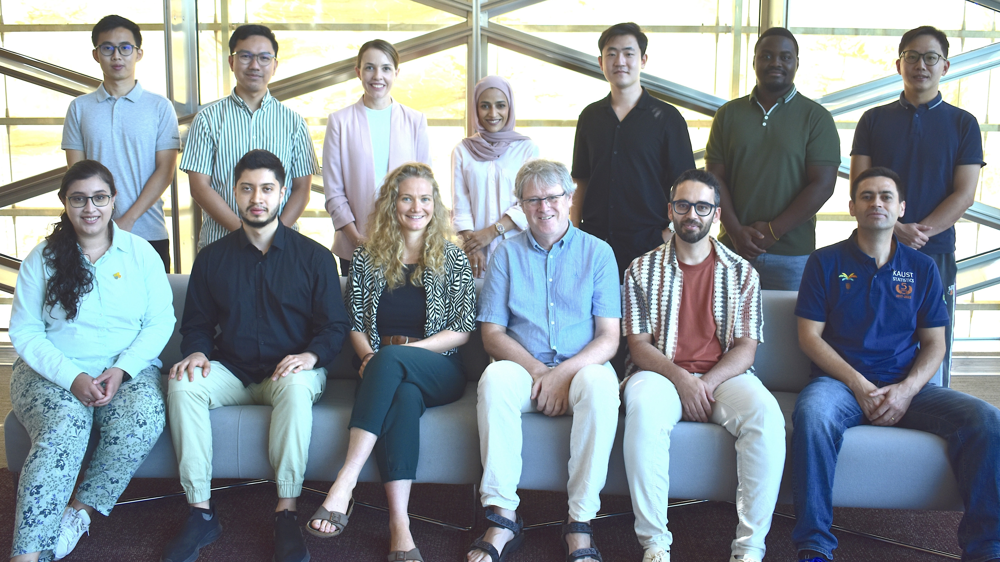
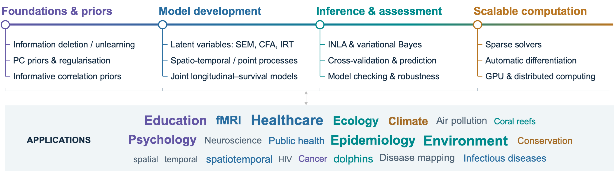
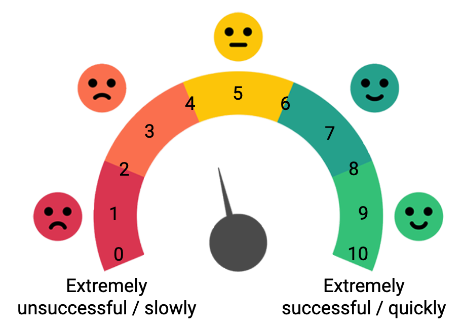

```{r}
#| include: false
#| eval: true
library(tidyverse)
library(gt)
library(INLAvaan)
library(lavaan)
source("R/kidney.R")
```

$$
\definecolor{kaustorg}{RGB}{241, 143, 0}
\definecolor{kausttur}{RGB}{0, 166, 170}
\definecolor{kaustmer}{RGB}{177, 15, 46}
\definecolor{kaustgrn}{RGB}{173, 191, 4}
\definecolor{kaustblu}{RGB}{82, 132, 196}
\definecolor{kaustpur}{RGB}{156, 111, 174}
$$

::: {.columns}

::: {.column width=50%}
::: {.nudge-up-large}

:::
:::

::: {.column width=50%}
> Bayesian Computational Statistics and Modeling Research Group (BAYESCOMP)

::: {.small-text}
Led by Prof. Håvard Rue---*Integrated Nested Laplace Approximation [INLA, @rue2009approximate]*
:::
:::

:::

. . .

::: {.nudge-up-xl}
{width=100% fig-align='center'}
:::

## Data context

::: {.callout-note icon=false title="Structural equation models (SEM) in a nutshell"}
Analyse multivariate data $\mathbf y=(y_1,\dots,y_p)^\top$ to [**measure**]{.text-org} and [**relate**]{.text-tur} *hidden* variables $\boldsymbol\eta=(\eta_1,\dots,\eta_q)^\top$, $q \ll p$, and uncover complex patterns.
:::

. . .

::: {.nudge-up-small}
In the social sciences, latent variables are used to represent **constructs**---the *theoretical, unobserved* concepts of interest.
:::

::: {.nudge-up}
:::: {.columns}

::: {.column width="25%"}
{height=210px}
:::

::: {.column width="25%"}
{height=210px}
:::

::: {.column width="25%"}
{height=210px}
:::

::: {.column width="25%"}
{height=210px}
:::

::::
:::

::: {.aside}
Photo credits: Unsplash
[\@dtravisphd](https://unsplash.com/photos/brown-fountain-pen-on-notebook-5bYxXawHOQg),
[\@impulsq](https://unsplash.com/photos/doctor-holding-red-stethoscope-hIgeoQjS_iE),
[\@ev](https://unsplash.com/photos/a-group-of-police-standing-next-to-each-other-zjeZXMU1SKE),
[\@benmullins](https://unsplash.com/photos/person-using-pencil-oXV3bzR7jxI).
:::

## European Social Survey (ESS) Round 5

Total $n=52,458$ respondents from 27 countries. Example of items measuring the construct *"Trust in Police Effectiveness"*:

::: {.columns}

::: {.column width=60%}

```{r}
#| eval: true
tribble(
  ~"Ser.", ~"Question", ~"Label",
  "D12",	"Based on what you have heard or your own experience how successful do you think the police are at preventing crimes in [country] where violence is used or threatened?",	"y1",
"D13", "How successful do you think the police are at catching people who commit house burglaries in [country]?",	"y2",
"D14",	"If a violent crime were to occur near to where you live and the police were called, how slowly or quickly do you think they would arrive at the scene?",	"y3"
) |>
  select(-Label) |>
  gt() |>
  cols_width(
    1 ~ px(65)
  ) |>
  tab_options(
    table.font.size = "85%",
    quarto.disable_processing = TRUE
  )
```

:::

::: {.column width=40%}
<br>

:::

:::

::: {.aside}
Data available from @ess2023ess5.
:::

## European Social Survey (ESS) Round 5 *(cont.)*

```{r, engine = "tikz"}
#| out-width: 65%
#| fig-align: center
#| eval: true
\usetikzlibrary{arrows.meta}
\definecolor{kaustblu}{RGB}{82, 132, 196}
\definecolor{kausttur}{RGB}{0, 166, 170}
\definecolor{kaustmer}{RGB}{177, 15, 46}
\definecolor{kaustbla}{RGB}{19, 21, 22}
\begin{tikzpicture}[
  font=\sffamily,
  latent/.style={circle, draw=none, minimum size=2.9cm, inner sep=0pt,
    align=center, text=white, font=\sffamily\bfseries\large},
  trust/.style={latent, fill=kaustblu},
  legit/.style={latent, fill=kausttur},
  coop/.style={latent, fill=kaustmer},
  path/.style={-{Latex[length=3.5mm, width=3mm]}, line width=1.3pt, draw=kaustbla!85},
  corr/.style={{Latex[length=3mm, width=2.6mm]}-{Latex[length=3mm, width=2.6mm]},
    line width=1.3pt, draw=kaustbla!35}
]

% Latent variables
\node[trust] (tpe) at (0, 0)       {Trust in\\police\\effective-\\ness};
\node[trust] (tpf) at (0, -3.5)    {Trust\\in police\\procedural\\fairness};
\node[legit] (obl) at (6.8, 0)     {Obligation\\to obey the\\police};
\node[legit] (mor) at (6.8, -3.5)  {Moral\\alignment\\with the\\police};
\node[coop]  (wil) at (13.6, 0)    {Willing-\\ness to\\cooperate};

% Structural paths
\draw[path] (tpe) -- (obl);
\draw[path] (tpe) -- (mor);
\draw[path] (tpf) -- (obl);
\draw[path] (tpf) -- (mor);
\draw[path] (obl) -- (wil);
\draw[path] (mor) -- (wil);
\draw[path] (tpe) to[bend left=22] (wil);
\draw[path] (tpf.-40) to[out=-35, in=-115] (wil.-120);

% Correlations
\draw[corr] (tpe.200) to[bend right=40] (tpf.160);
\draw[corr] (obl.-42) to[bend left=30] (mor.42);

% Trim the bounding box (curve control points otherwise add white space)
\pgfresetboundingbox
\path[use as bounding box] (-2.0, 1.85) rectangle (15.1, -5.9);
\end{tikzpicture}
```

::: {.nudge-up}
- Modelling procedural fairness theory linking trust, legitimacy, and compliance with authorities [@jackson2011developing; @jackson2011trust].

- Big and layered data suited for Bayesian approaches. But model fit and evaluation can be computationally challenging or time-consuming.

- Often, country-level effects are ignored, but they can be crucial in understanding the variability in the latent constructs across countries.
:::

## Programme for International Student Assessment (PISA)

::: {.columns}

::: {.column width=3.33%}
:::

::: {.column width=55%}

:::

::: {.column width=3.33%}
:::

::: {.column width=35%}
[](https://www.youtube.com/shorts/hIzX6r3IQbg)
:::

::: {.column width=3.33%}
:::


:::


## PISA *(cont.)*

```{r, engine = "tikz"}
#| out-width: 75%
#| fig-align: center
#| eval: true
\usetikzlibrary{arrows.meta,calc}
\definecolor{kausttur}{RGB}{0, 166, 170}
\definecolor{kaustyel}{RGB}{240, 181, 0}
\definecolor{kaustpur}{RGB}{156, 111, 174}
\definecolor{kaustbla}{RGB}{19, 21, 22}
\begin{tikzpicture}[
  font=\sffamily,
  latent/.style={circle, draw=none, minimum size=2.2cm, inner sep=0pt,
    align=center, text=white, font=\sffamily\bfseries\large},
  item/.style={rectangle, draw=#1, line width=1pt, fill=#1!15, minimum size=5.5mm},
  missing/.style={dash pattern=on 2pt off 1.5pt, fill=white},
  % Items not answered (planned missingness)
  miss/sci2/.style={missing}, miss/sci5/.style={missing},
  miss/mat1/.style={missing}, miss/mat4/.style={missing}, miss/mat5/.style={missing},
  miss/rea3/.style={missing},
  load/.style={-{Latex[length=2.5mm, width=2mm]}, line width=0.9pt, draw=kaustbla!70},
  corr/.style={{Latex[length=3mm, width=2.6mm]}-{Latex[length=3mm, width=2.6mm]},
    line width=1.3pt, draw=kaustbla!35}
]

% Latent abilities
\node[latent, fill=kausttur] (sci) at (0, 0)  {Science};
\node[latent, fill=kaustyel, text=kaustbla] (mat) at (6, 0)  {Math};
\node[latent, fill=kaustpur] (rea) at (12, 0) {Reading};

% Test items (six per domain), fanning out above each ability
\foreach \lv/\col in {sci/kausttur, mat/kaustyel, rea/kaustpur} {
  \foreach \k in {1,...,6} {
    \node[item=\col, miss/\lv\k/.try] (\lv\k) at ($(\lv) + (-2.25 + 0.9*\k - 0.9, 3)$) {};
    \draw[load] (\lv) -- (\lv\k);
  }
}

% Correlations between abilities
\draw[corr] (sci.-20) to[bend right=30] (mat.-160);
\draw[corr] (mat.-20) to[bend right=30] (rea.-160);
\draw[corr] (sci.-80) to[bend right=25] (rea.-100);
\end{tikzpicture}
```


::: {.nudge-up}
- PISA uses 2PL *item response theory (IRT)* models to measure unobserved proficiency from item responses.

- **Estimation involves large-scale, multi-group calibration and latent population modelling**, with incomplete forms and complex survey sampling. 

- Population inference uses *plausible values* (draws from students' conditional proficiency posteriors), given fitted item and population parameters.
:::

## Advancing scalable Bayesian methods for latent variable modelling

### Håvard Rue (PI) + Haziq Jamil (co-I)

::: {.columns}

::: {.column width=70%}
::: {.nudge-down}
::: {.small-text}
>  - **Jamil, H.**, & Rue, H. (2026a). *Approximate Bayesian inference for structural equation models using integrated nested Laplace approximations* ([`arXiv:2603.25690 [stat.ME]`](https://doi.org/10.48550/arXiv.2603.25690)).^[Under review at Psychometrika ([Q1, Applied Mathematics](https://www.scimagojr.com/journalsearch.php?q=14061&tip=sid&clean=0)).]
> - **Jamil, H.**, & Rue, H. (2026b). *Implementation and workflows for INLA-based approximate Bayesian structural equation modelling*([`arXiv:2604.00671 [stat.CO]`](https://doi.org/10.48550/arXiv.2604.00671)).^1^
>  - Alhyari, M., **Jamil, H.**, Montcho, H., & Rue, H. (2026). *Deterministic Leave-One-Cluster-Out Cross-Validation for Multilevel Bayesian Structural Equation Models* ([`arXiv:2609.00670 [stat.ME]`](https://doi.org/10.48550/arXiv.2609.00670)).^1^
> - R Package: <https://github.com/haziqj/INLAvaan>
:::
:::
:::

::: {.column width=30%}
::: {.nudge-up-small}
::: {style="font-size: 89%;"}
Supported by the 2025 KAUST Competitive Research Grant (CRG)^[<https://bayescomp.kaust.edu.sa/articles/2026/03/10/bayescomp-group-secures-crg-funding-revolutionize-latent-variable-modeling>].
:::

```{=html}
<style>
.wp-stack { display: flex; flex-direction: column; gap: 10px; margin-top: 18px; }
.wp-card { border-left: 7px solid var(--c); border-radius: 6px; background: #f6f6f6; padding: 8px 12px; }
.wp-card .wp-title { font-size: 0.55em; font-weight: 700; color: var(--d); line-height: 1.15; }
.wp-card .wp-tag { font-size: 0.75em; color: var(--c); margin-right: 4px; }
.wp-card .wp-text { font-size: 0.45em; font-weight: 300; line-height: 1.3; margin-top: 2px; }
</style>
<div class="wp-stack">
  <div class="wp-card" style="--c:#9C6FAE; --d:#6D2463;">
    <div class="wp-title"><span class="wp-tag">WP1</span> Theory &amp; model mapping</div>
    <div class="wp-text">Fast Bayesian SEM for continuous, binary &amp; ordinal items</div>
  </div>
  <div class="wp-card" style="--c:#00A6AA; --d:#004C59;">
    <div class="wp-title"><span class="wp-tag">WP2</span> Latent traits on a map</div>
    <div class="wp-text">Spatial SEM &amp; IRT with SPDE random fields</div>
  </div>
  <div class="wp-card" style="--c:#adbf04; --d:#595403;">
    <div class="wp-title"><span class="wp-tag">WP3</span> Latent traits in time</div>
    <div class="wp-text">Growth curves &amp; dynamic SEM</div>
  </div>
  <div class="wp-card" style="--c:#F18F00; --d:#804900;">
    <div class="wp-title"><span class="wp-tag">WP4</span> Software &amp; dissemination</div>
    <div class="wp-text">Open-source R package: INLAvaan</div>
  </div>
</div>
```

:::
:::

:::

## Outline

```{=html}
<style>
.lv-stack { display: grid; grid-auto-rows: 1fr; gap: 15px; margin-top: 6px; }
.lv-card { display: grid; grid-template-columns: 1fr 31%; background: #fff; border-radius: 12px; overflow: hidden; box-shadow: 0 1px 2px rgba(0, 0, 0, .06), 0 4px 14px rgba(0, 0, 0, .08); }
.lv-card > p { order: 2; position: relative; margin: 0 !important; }
.reveal .lv-card img { position: absolute; inset: 0; width: 100%; height: 100%; object-fit: cover; margin: 0; max-width: none; max-height: none; }
.lv-text { display: flex; flex-direction: column; justify-content: center; padding: 9px 16px 11px; }
.lv-text p { margin: 0 !important; }
.lv-top { display: flex; justify-content: space-between; align-items: baseline; font-size: 12.5px; }
.lv-tag { font-weight: 700; letter-spacing: .1em; text-transform: uppercase; color: var(--c); }
.lv-title { display: block; font-size: 17px; font-weight: 700; line-height: 1.22; margin: 3px 0; text-wrap: balance; }
.lv-body { display: block; font-size: 15px; line-height: 1.32; color: #27343B; text-wrap: pretty; }
</style>
```

::: {.columns}

::: {.column width=50%}
1. **Brief overview of SEMs**
    - Motivating example
    - Bayesian inference
    - Marginal likelihood
2. **INLA-based inference**
    - Joint Gaussian approximation with variational mean correction
    - Skew-normal Laplace profiling of posterior marginals
    - Gaussian copula sampling
3. **The INLAvaan R package**
:::

::: {.column width=50%}
::: {.small-text}
::: {.center-h}
[**Latent variables related to KAUST's agenda**]{.text-org}
:::

::: {.lv-stack}
::: {.lv-card style="--c:#595403;"}


::: {.lv-text}
[[🌾 Food]{.lv-tag} [@cafiero2018food]{.lv-src}]{.lv-top}
[The UN food insecurity measure]{.lv-title}
[A Rasch model on eight yes/no questions, from worrying about food to going a whole day without eating, behind SDG indicator 2.1.2.]{.lv-body}
:::
:::

::: {.lv-card style="--c:#003B75;"}


::: {.lv-text}
[[💧 Water]{.lv-tag} [@young2019household]{.lv-src}]{.lv-top}
[One scale for household water insecurity]{.lv-title}
[Twelve questions, validated on 8,127 households at 28 sites in 23 countries, and unidimensional in factor analyses.]{.lv-body}
:::
:::

::: {.lv-card style="--c:#6D2463;"}


::: {.lv-text}
[[🤖 AI]{.lv-tag} [@burnell2023revealing · @maiapolo2024tinybenchmarks]{.lv-src}]{.lv-top}
[LLMs have latent abilities too]{.lv-title}
[Factor analysis reveals abilities like reasoning and comprehension. IRT finds a benchmark's most informative questions, so far fewer are needed.]{.lv-body}
:::
:::

::: {.lv-card style="--c:#004C59;"}


::: {.lv-text}
[[🌿 Environment]{.lv-tag} [@grace2016integrative]{.lv-src}]{.lv-top}
[SEM sees what raw correlations hide]{.lv-title}
[Across 1,126 grassland plots on five continents, species richness boosts productivity, in contrast with the raw data pattern.]{.lv-body}
:::
:::
:::
:::
:::

:::

::: aside
Photo credits: Unsplash [\@pazarando](https://unsplash.com/photos/person-holding-stack-of-wheat-zwZusrYAGoM), [\@_mrjn_esf](https://unsplash.com/photos/pouring-water-on-persons-hands-YpZ2cj4s0oo), [\@katjaano](https://unsplash.com/photos/child-touching-white-robotic-hand-_7ceGXTAtyQ), [\@jarlock55](https://unsplash.com/photos/hand-touching-grass-in-sunlit-field-cbpbQ1LjAws).
:::

# Structural equation models {.transition-slide}



# INLA-based posterior approximation {.transition-slide}



# R/INLAvaan {.transition-slide}



# Conclusion {.transition-slide}

## Summary

- 🚀 INLA methodology offers a rapid alternative for SEM, delivering Bayesian results at near the speed of frequentist estimators. 
   - Not aiming to replace MCMC; use case is model development, testing, and exploratory analysis.

::: {.columns}

::: {.column width=58%}
- Forward looking
  - Non-Gaussian outcomes (e.g. categorical, count)
  - Better prior support [priors for correlation matrices @freni2026informative; penalised complexity priors @simpson2017penalising]
  - Dynamic SEM, including continuous-time SEM [@driver2017continuous]
  - Spatiotemporal extensions  [@krainski2018advanced]
:::

::: {.column width=2%}
:::

::: {.column width=40%}
[{width=60% fig-align=center}](https://inlavaan.haziqj.ml/)

<center>[]{.small-text}</center>

:::

:::

- Vignettes and tutorials available on <https://inlavaan.haziqj.ml/>:
Equality constraints, defined parameters, multigroup, multilevel, and missing data.


# شكراً جزيلاً {.thanks-slide  background-image="_extensions/haziqj/kaust/KAUST-Thank-you.jpg" style="padding-top:0.5em;padding-bottom:0em"}

[``r params$url``](`r params$url`)

## References

::: {.content-hidden unless-meta="nogif"}
<style>
#refs { column-count: 3; column-gap: 1.5em; font-size: 0.55em; line-height: 1.25; }
#refs .csl-entry { break-inside: avoid; }
</style>
:::
